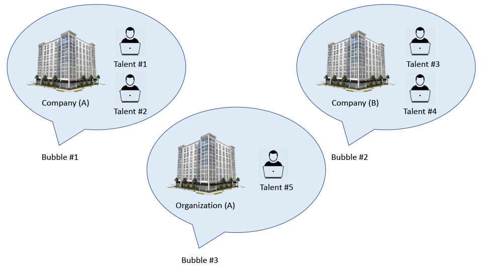
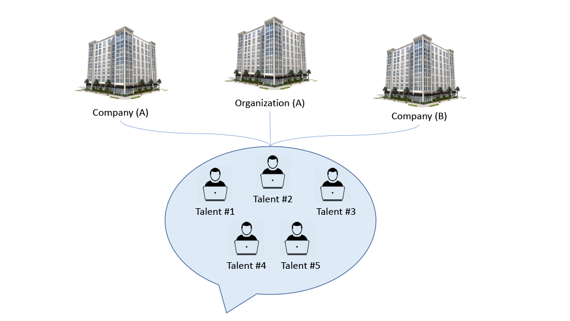

# Business Strategy
We're an engineering firm. And the way we’re doing business corresponds to engineering and scientific principles. We’re not relying on luck, misleading marketing, or politics. And we’re not exploiting vulnerable clients.
Our clients and partners do business with us for being transparent, trustworthy, reliable and realistic.
More details are provided in our <a href="https://github.com/ShiftSoftware/The-Shift-Method/blob/main/Code%20of%20Conduct.md"><strong>Code of Conduct</strong></a>.

 

# Team & Community
We aim to be an open organization. Open internally, with clients/customers, and open with the outside community. 
This openness ensures trust and scalability. We aim to be placed in a position where:
<ul>
  <li>Clients/investors seek our service for their businesses because they’re certain we’ll execute it in the best possible manner.</li>
  <li>Individuals & Other firms in our industry are willing to collaborate and get on board with us because they’re certain we’ll take their interests into consideration in the best possible manner.</li>
</ul>

 

# Our Vision
We started by developing and maintaining custom software and platforms for local enterprises and organizations. 
<ul>
  <li>Our <strong>short-term</strong> goal is to provide the tools, the guidance and the required consultation to platform owners that will enable them to enhance and build upon their platforms in-house.</li>
  <li>Our <strong>long-term</strong> goal is to focus on building tools for everyone without much intervention on what those tools are used for building.</li>
  <li>And our <strong>ultimate</strong> goal is to export our tools to people, businesses, and organizations outside our local market and country.</li>
</ul>

 

# Specialization
Combining a pool of talent that's collabrating together in building and providing long term support for a diverse set of industries would provide a much greater value for all envolved parties than if the talents are spread out.
The combined concentrated.
  

# 
### Inefficient (Unutilized)
 

 

# 
### Efficient (Utilized)

## 